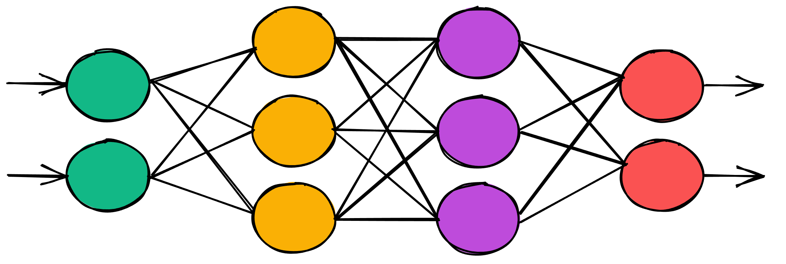
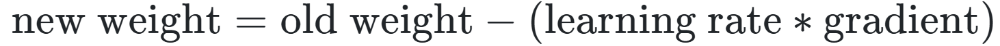
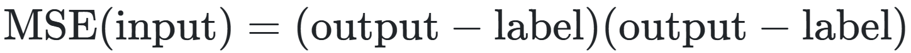

# 深度学习笔记

## 1.机器学习

​        机器学习是使用算法分析数据，从数据中学习，然后对新数据做出确定或预测的做法。

​        通过机器学习，机器不是使用一组特定的指令手动编写代码来完成特定任务，而是使用数据和算法进行训练，使其能够在没有明确告知的情况下执行任务 


## 2.深度学习

​      深度学习是一种可用于实施机器学习的工具或技术

​     深度学习是机器学习的一个子领域，它使用受大脑神经网络结构和功能启发的算法。

​      在深度学习中使用的神经网络并不是真正的生物神经网络。它们只是与生物神经网络共享一些特征，因此，我们称它们为***人工*神经网络 （ANN）**



深度学习使用一种特定类型的 ANN，我们称之为**深度网络或深度人工神经网络** 

* 人工神经网络是使用我们所谓的神经元构建的。
* ANN 中的神经元被组织成我们所说的层。
* ANN *中的*图层（除输入和输出图层之外的所有图层）称为隐藏图层。
* 如果 ANN 具有多个隐藏层，则称该 ANN 为深度 ANN。


## 3.人工神经网络

​         人工神经网络是一种计算系统，它由一组称为神经元的连接单元组成，这些单元被组织成我们所说的层。

​         连接的神经单元形成所谓的网络。神经元之间的每个连接都会将信号从一个神经元传输到另一个神经元。接收神经元处理信号并将信号发送到网络内连接到它的下游神经元。注意 神经元通常也称为节点。

​         每个 ANN 中有三种类型的层：       1.输入层         2.隐藏图层      3.输出层

​         在 Keras 中，我们可以构建所谓的 Sequential 模型。

​         dense 层的每个输出都是使用该层的每个输入计算的


##  4.图层类型：

- 密集（或完全连接）层

- 卷积层

- 池化层

- 复发层

- 归一化层

  ​       卷积层通常用于处理图像数据的模型。递归层用于处理时间序列数据的模型，而全连接层,完全连接每个输入添加到其层中的每个输出中。

  ​        **两个节点之间的每个连接都有一个关联的权重**

  ​        每个权重表示两个节点之间的连接强度。当网络在输入层的给定节点收到输入时，此输入将通过连接传递到下一个节点，并且**输入将乘以权重分配给该连接**。

  ​                   **节点输出 = 激活（输入的加权和）**

  ​         **输出层中的节点数取决于我们拥有的可能的输出或预测类的数量**

  ​         对于数据集中的给定样本，从输入层到输出层的整个过程称为通过网络的**正向传递**。

  ​         随着模型的学习，所有连接的权重都会更新和优化，以便输入数据点映射到正确的输出预测类。

  例：创建层

  ```python
layers = [
      Dense(units=6, input_shape=(8,), activation='relu'),
    Dense(units=6, activation='relu'),
      Dense(units=4, activation='softmax')
  ]
  ```
  
  ​       列表中指定的第一个对象是第一个隐藏层。
  
  ​       我们的输入形状是 8,  第一个隐藏层有 6 个节点，第二个隐藏层也有 6 个节点，输出层有 4 个节点。

  

  ## 5.激活函数

  ​        在人工神经网络中，激活函数是将节点的输入映射到其相应输出的函数。

  ​        **节点输出 = 激活（输入的加权和）**

  ​        激活函数将总和转换为通常介于某个下限和某个上限之间的数字。此转换通常是**非线性转换**

  ​        sigmoid:    更接近1，神经元越活跃，而越接近0神经元的激活度就越低。

  ​        relu:           relu(x) = max(0, x)    


​       线性函数： 两个线性函数的组合也是一个线性函数。这意味着，如果我们在前向传递期间只对数据值进行线性转换，则在我们的网络中，从 input 到 output 的 learned 映射也是线性的。

模型实例化后将层和激活函数添加到我们的模型中，如下所示：

```python
model = Sequential()
model.add(Dense(units=5, input_shape=(3,)))
model.add(Activation('relu'))
```


## 6.训练人工神经网络

​         任务：**找到最准确地将输入数据映射到正确输出类的权重**

​         优化算法：权重使用我们所谓的优化算法进行优化，优化过程取决于所选的优化算法

​         最广为人知的优化器称为**随机梯度下降（SGD):**                                                                                                          SGD 的目标是**最小化我们称为损失函数**的某些给定函数。因此，SGD 以使此损失函数尽可能接近其最小值的方式更新模型的权重。

​         **损失函数**：损失是网络对图像的预测与图像的真实标签之间的误差或差异,  如*均方误差* （MSE）

​         通过我们的模型传递所有数据后，我们将继续一遍又一遍地传递相同的数据。**这种通过网络重复发送相同数据的过程被视为*训练***。


## 7 .在人工神经网络中学习

​       一旦数据集中的所有数据点都通过网络，我们就说一个 **epoch** 完成了

​       纪元是指在训练期间将整个数据集单次传递到网络。

​        获得输出后，可以通过查看模型预测的内容与真实标签来计算该特定输出的损失（或误差）。

#### 损失函数的梯度:

​        计算损失后，将计算此损失函数相对于网络内每个权重的梯度

​        使用损失函数的梯度值来更新模型的权重。梯度告诉我们哪个方向会将损失推向最小，我们的任务是朝着降低 loss 并逐渐接近此最小值。

#### 更新权重:



当计算损失函数的梯度时，每个权重的梯度值会有所不同，因为**梯度是相对于每个权重计算的**


在训练模型之前，必须编译它

```python
model.compile(
    optimizer=Adam(learning_rate=0.0001), 
    loss='sparse_categorical_crossentropy', 
    metrics=['accuracy']
)
```

## 8.损失函数：

**均方误差**：



## 9.学习率：

​       我们可以将模型的学习率视为*步长*。

​		学习率太大，可能越过最小值，太小需要更长的时间才能达到最小化损失的点


## 10.训练、测试和验证集

出于模型的训练和测试目的，我们应该将数据分解为三个不同的数据集：

- 训练集

- 验证集

- 测试集

   验证集是一组独立于训练集的数据集，用于在训练期间验证我们的模型。

   当模型对此数据进行验证时，此数据不包含模型已经熟悉的训练样本。

   测试集与其他两个测试集之间的一个主要区别是测试集不应该被标记
   
   
   
   **过拟合**:  模型非常擅长对训练集进行分类，但它无法对未经过训练的数据进行泛化和准确分类。

#### 深度学习数据集：

| 数据   | 更新权重 | 描述                                                         |
| ------ | -------- | ------------------------------------------------------------ |
| 训练集 | 是的     | 用于训练模型。训练的目标是使模型适应训练集，同时仍泛化到看不见的数据。 |
| 验证集 | 不       | 在训练期间用于检查模型的泛化程度。                           |
| 测试集 | 不       | 用于在部署到生产环境之前测试模型的最终泛化能力。             |

拥有三个独立数据集的主要原因是确保模型能够通过准确预测看不见的数据来泛化。

